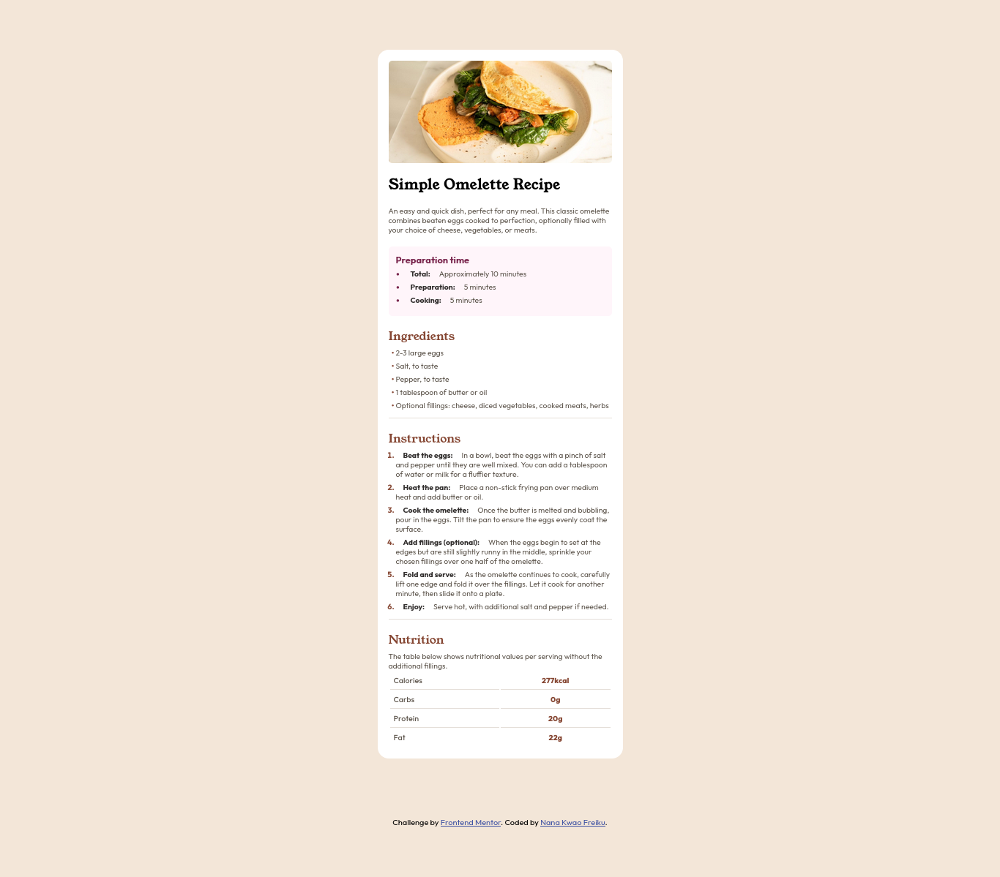
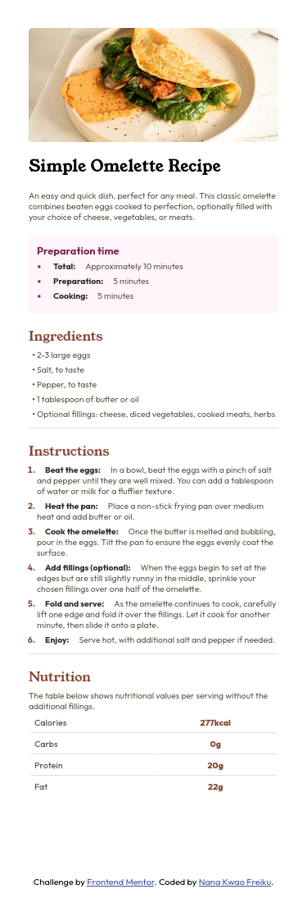

# Frontend Mentor - Recipe page solution

This is a solution to the [Recipe page challenge on Frontend Mentor](https://www.frontendmentor.io/challenges/recipe-page-KiTsR8QQKm). Frontend Mentor challenges help you improve your coding skills by building realistic projects.

## Overview

This project is a solution to the Recipe page challenge from Frontend Mentor. The goal was to create a visually appealing recipe card using only HTML and CSS. The component displays a recipe image, title, description, preparation time, ingredients, instructions, and nutrition information, all styled for clarity and modern aesthetics.

The project focuses on semantic HTML structure, responsive design using Flexbox and CSS Grid, and custom styling with CSS variables and custom fonts. The page is fully responsive and adapts well to different screen sizes, making it suitable for both desktop and mobile devices.

### Screenshot




### Links

- Solution URL: [https://github.com/nana-kwao/recipe-page-challenge](https://github.com/nana-kwao/recipe-page-challenge)
- Live Site URL: [https://nana-kwao.github.io/recipe-page-challenge](https://nana-kwao.github.io/recipe-page-challenge)


### Built with

- Semantic HTML5 markup
- CSS custom properties
- Flexbox
- CSS Grid
- Mobile-first workflow

### What I learned

While working on this project, I strengthened my understanding of semantic HTML and responsive design using Flexbox and CSS Grid. I learned how to structure a recipe card with clear sections, use custom fonts for improved aesthetics, and apply CSS variables for consistent theming. I also practiced making the layout adapt well to different screen sizes.

Here are some code snippets that highlight what I learned:

```html
<section class="ingredient">
  <p class="sub-header">Ingredients</p>
  <ul>
    <li>2-3 large eggs</li>
    <li>Salt, to taste</li>
    <li>Pepper, to taste</li>
    <li>1 tablespoon of butter or oil</li>
    <li>Optional fillings: cheese, diced vegetables, cooked meats, herbs</li>
  </ul>
</section>
```
```css
body {
  display: flex;
  flex-direction: column;
  justify-content: center;
  align-items: center;
  min-height: 100vh;
  background-color: hsl(30, 54%, 90%);
  padding: 5%;
}
.container {
  width: 335px;
  background-color: hsl(0, 0%, 100%);
  padding: 15px;
  border-radius: 15px;
  gap: 1rem;
}
```

## Author

- Frontend Mentor - [@nana-kwao](https://www.frontendmentor.io/profile/nana-kwao)
- Twitter - [@f_nanakwao](https://www.twitter.com/f_nanakwao)

## Acknowledgments

Thanks to the Frontend Mentor community for inspiration and assistance. Special thanks to those who provided feedback on my solution.
